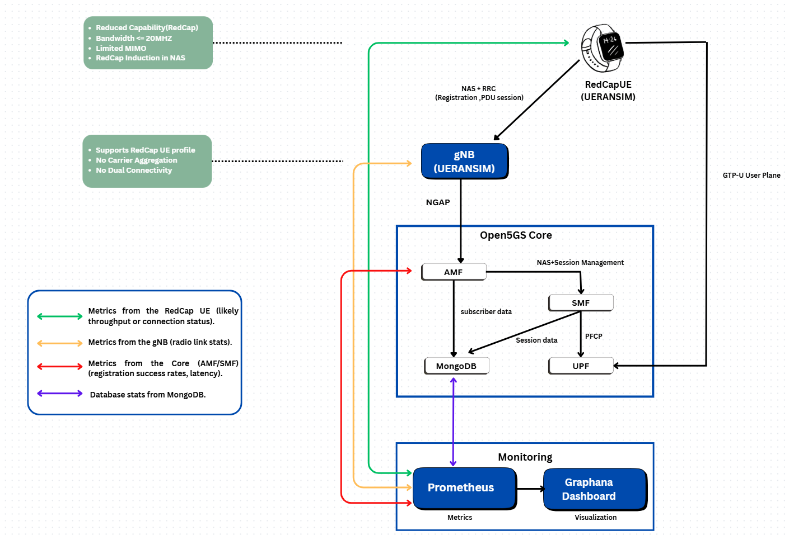

<h1 align="center">5G RedCap TestBed and Attack Vectors </h1>
<h3 align="center"> Physical & Power-Saving Exploits Simulation </h3>
<h5 align="center"> Research Project - <a href="https://linkedin.com/in/p1r3x">Pavan Raja - AM.SC.P2CSN24014</a> (2025) </h5>


## ➤ Overview

This project implements a complete **5G Standalone (SA) RedCap testbed** to investigate security vulnerabilities unique to Reduced Capability (RedCap) devices. Unlike traditional testbeds, this work places a strong emphasis on **system-level monitoring and energy-aware attack analysis**.

By integrating Open5GS, UERANSIM, and a Prometheus-Grafana pipeline, the testbed enables quantitative evaluation of how RedCap-specific hardware (1Rx, HD-FDD) and protocol constraints (eDRX) can be exploited to cause resource exhaustion, timing failures, and energy drain.


<h2 id="table-of-contents"> Table of Contents</h2>

<details open="open">
  <summary>Table of Contents</summary>
  <ol>
    <li><a href="#architecture"> ➤ Architecture</a></li>
    <li><a href="#monitoring"> ➤ Monitoring & Observability</a></li>
    <li><a href="#files"> ➤ Project Files</a></li>
    <li><a href="#setup"> ➤ Setup and Requirements</a></li>
    <li><a href="#scenario1"> ➤  Working On Scenario 1: Physical Layer Exploits</a></li>
    <li><a href="#scenario2"> ➤  Working On Scenario 2: Power-Saving Exploits</a></li>
    <li><a href="#results"> ➤ Results & Accomplishments</a></li>
    <li><a href="#references"> ➤ References</a></li>
  </ol>
</details>


<h2 id="architecture"> Architecture</h2>

The testbed is organized into four logical layers to bridge the gap between protocol design and real-world attack impact.

| Layer | Component | Description |
| :--- | :--- | :--- |
| **1. UE & RAN** | **UERANSIM** | Simulates both gNB and RedCap-like UE using custom YAML configurations to emulate reduced capability behavior. |
| **2. Core Network** | **Open5GS** | Implements a full 5G SA core (AMF, SMF, UPF, etc.) with SBI interfaces binding to loopback addresses. |
| **3. Monitoring** | **Prometheus & Node Exporter** | Collects time-series metrics (Port 9091) and host-level telemetry (Port 9100). |
| **4. Analysis** | **Grafana** | Visualizes baseline behavior, attack impacts, and energy-aware mitigation comparisons (Port 3000). |




<h2 id="monitoring"> Monitoring & Observability</h2>

Since Open5GS does not natively expose Prometheus metrics, this project uses system-level telemetry as a proxy to quantify attack impact—a standard practice in telecom security research.

### Key Metrics Collected
* **CPU:** Utilization, load, scheduler pressure, and waiting time (PSI).
* **Network:** RX/TX throughput and packet rate.
* **Energy:** RAPL/energy proxies (where supported).
* **Memory:** Available, active, and slab memory usage.

> **Note:** Prometheus scrapes these metrics every 5 seconds to enable high-resolution attack correlation.


<h2 id="files"> Project Files Description</h2>

* **`amf.yaml`**: Open5GS AMF configuration (NGAP IP: 127.0.0.5, PLMN ID: 999/70).
* **`gnb2.yaml`**: Custom gNodeB configuration for RedCap simulation.
* **`ue2.yaml`**: Custom RedCap-like User Equipment configuration.
* **`open5gs-gnb.yaml` / `open5gs-ue.yaml`**: Base templates for RAN and UE.
* **`testbed_setup.pdf`**: Log file documenting installation and execution steps.


<h2 id="setup"> Setup and Requirements</h2>

### Prerequisites
* **OS:** Ubuntu 22.04 (Jammy)
* **Runtime/Build:** Node.js v18+, GCC/G++, CMake, MongoDB
* **Tools:** Wireshark, Docker (Optional)

### Installation Steps

1.  **Install Open5GS & MongoDB**
    ```bash
    sudo add-apt-repository ppa:open5gs/latest
    sudo apt install open5gs
    ```

2.  **Install & Build UERANSIM**
    ```bash
    git clone [https://github.com/aligungr/UERANSIM](https://github.com/aligungr/UERANSIM)
    cd UERANSIM
    make
    ```

3.  **Setup Monitoring Pipeline**
    * **Prometheus:** Configure to listen on port `9091`.
    * **Node Exporter:** Configure to listen on port `9100`.
    * **Grafana:** Configure to listen on port `3000`.

4.  **Configure WebUI**
    Set up the subscriber in the Open5GS WebUI (`localhost:9999`) with IMSI matching `ue2.yaml`.


<h2 id="scenario1"> Working On Scenario 1: Physical Layer Exploits (Hardware)</h2>

**Motivation:** RedCap devices are limited to Single Receive Antenna (1Rx) and Half-Duplex FDD (HD-FDD).

### Attack Vectors
1.  **PRB Resource Exhaustion:** Flooding 1Rx requests to starve legitimate users due to lower spectral efficiency.
2.  **HD-FDD Timing Attacks:** Exploiting the "cannot transmit and receive simultaneously" constraint to force Paging Loss.

### Observability
* **CPU:** Significant pressure spikes.
* **Network:** RX bursts.
* **System:** Scheduler contention.


<h2 id="scenario2"> Working On Scenario 2: Power-Saving Exploits (Protocol)</h2>

**Motivation:** RedCap relies on Extended DRX (eDRX) and Relaxed RRM measurements to extend battery life.

### Attack Vectors
1.  **Sleep Cycle Manipulation:** Forcing devices into deep sleep (DoS) or preventing sleep (Battery Draining).
2.  **RRM Spoofing:** Tricking devices into stopping neighbor cell measurements, leading to Radio Link Failure (RLF).

### Observability
* **CPU:** Repeated unexpected wakeups.
* **Energy:** Sustained energy drain signatures.
* **System:** Persistent low-rate stress.


<h2 id="results"> Results & Accomplishments</h2>

**Validation:**
* **Connectivity:** Successful 5G SA registration and PDU session establishment verified via NGAP/NAS logs.
* **Monitoring:** Continuous metric scraping confirmed via Prometheus, with attack stress visualized in Grafana.

**Paper Submission:**
* Completed a 45-page survey paper: *"A Comprehensive Survey on 5G RedCap: Technologies, Security Vulnerabilities, and Attack Vectors"*.


<h2 id="references"> References</h2>

1.  **3GPP**, "TS 38.875: Study on support of reduced capability NR devices (Release 17)".
2.  **Open5GS**, Open Source 5G Core, https://open5gs.org.
3.  **UERANSIM**, Open Source 5G UE and RAN Simulator, https://github.com/aligungr/UERANSIM.
4.  **Industrial Papers**: Whitepapers from GSMA, Ericsson, and Quectel.
